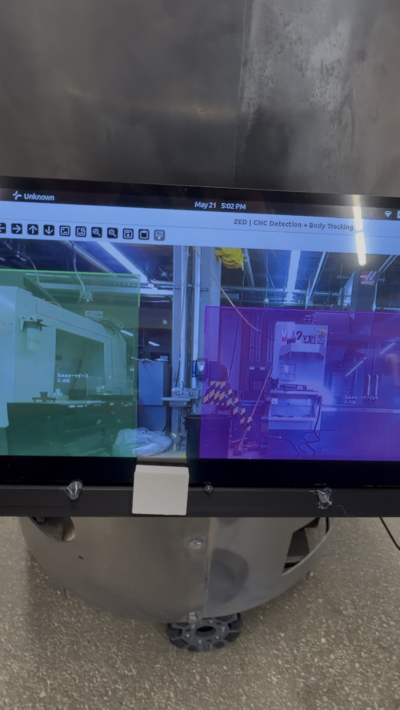
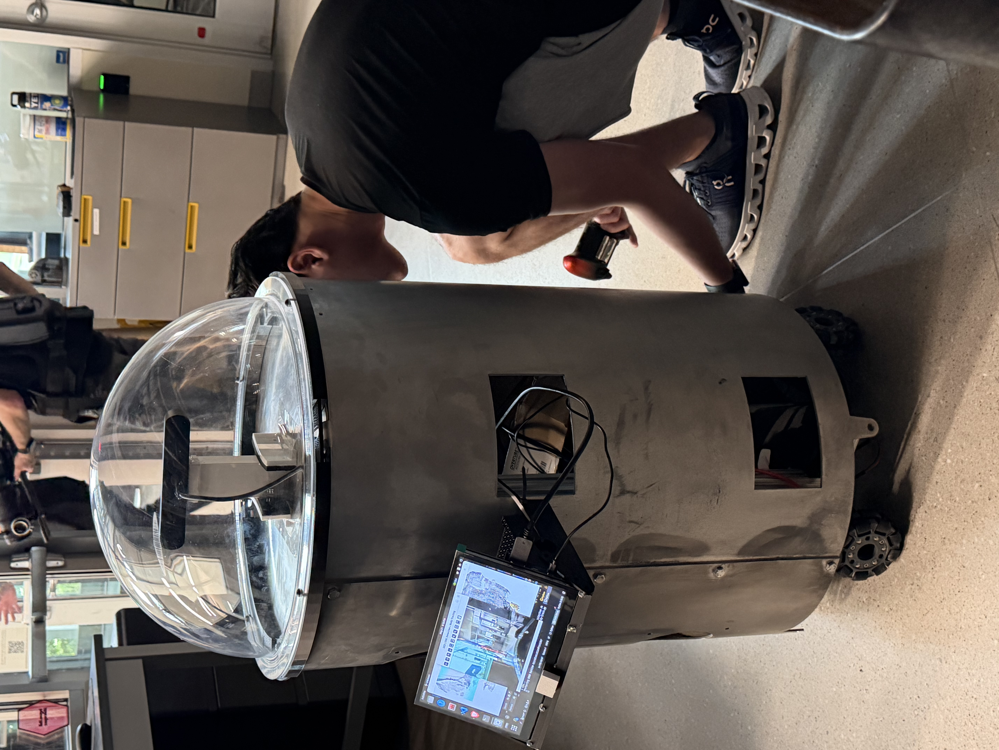
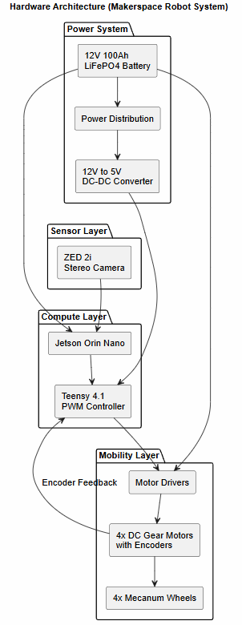
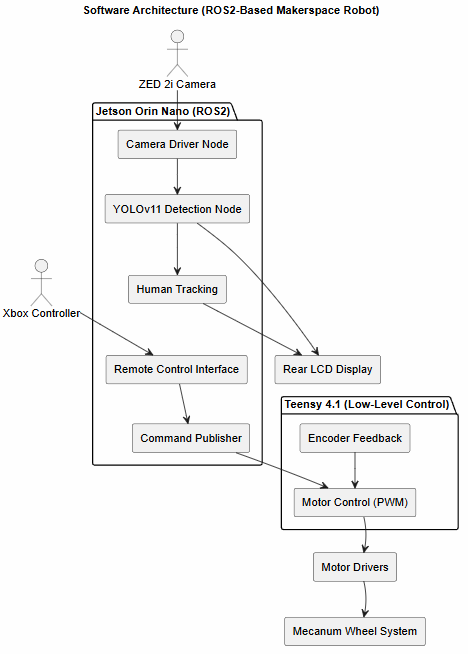
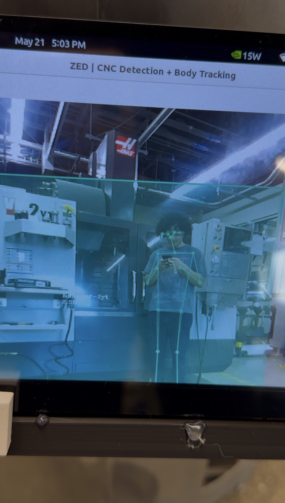

# MARS: Makerspace Autonomous Robot System

**MARS** is an autonomous robotics platform built for the TXST Ingram School of Engineering Makerspace as part of the **Makerspace Digital Twin** initiative (IEEE Robotics & Automation Society at Texas State). It combines omnidirectional mobility, an embedded motor-control stack, and a real-time stereo-vision perception pipeline that detects CNC machines and tracks people simultaneously.

This repository holds the **perception software** that runs on the robot: a ZED stereo camera driving a custom YOLOv11 model for machine detection alongside ZED's body tracking for people. The sections below cover both the perception pipeline and the wider robot it runs on.

`Python` · `YOLOv11 / Ultralytics` · `ONNX` · `ZED SDK` · `OpenCV` · `OpenGL` · `Jetson Orin Nano` · `Teensy 4.1`



---

## The Robot

MARS is a cylindrical, dome-topped mobile robot designed for indoor makerspace mobility and perception research.




| Subsystem | Components |
|---|---|
| **Compute & Embedded** | NVIDIA Jetson Orin Nano, Teensy 4.1 microcontroller, Xbox controller (teleop) |
| **Perception** | ZED 2i stereo depth camera, custom YOLOv11 CNC detector, ZED body tracking |
| **Mobility** | 4x mecanum wheels, 4x DC gear motors with encoders, motor drivers |
| **Power** | 12V 100Ah LiFePO4 battery, 12V to 5V DC-DC converter, power distribution wiring |
| **Mechanical** | Cylindrical aluminum chassis, acrylic dome enclosure, internal mounting structure, rear LCD display |

### System Architecture

The hardware splits into power, sensor, compute, and mobility layers. A 12V LiFePO4 battery feeds power distribution and a 12V to 5V converter; the Jetson Orin Nano handles compute and high-level control, while the Teensy 4.1 runs PWM motor control with encoder feedback to drive the mecanum wheels.



On the software side, the target design is a ROS2 node graph: a camera driver feeds YOLOv11 detection and human tracking, an Xbox-driven remote-control interface publishes commands, and the Teensy handles low-level motor control. (The perception software in this repo currently runs as a single Python script, with the full ROS2 graph below as the intended architecture.)



---

## Perception Pipeline

This repo's perception software (`obj-detect-body-track.py`) runs the full detect-and-track loop in real time.

**Step 1: Capture.**
The ZED camera grabs a stereo frame. The left-eye image goes to YOLO for machine detection; both eyes are used by the ZED SDK to compute depth.

**Step 2: CNC Machine Detection.**
A custom YOLOv11 ONNX model (`best.onnx`) runs on each frame and detects three machines:
- `haas-st-20y`
- `haas-vf-2yt`
- `haas-vf-3`

It outputs 2D bounding boxes with confidence scores.

**Step 3: 3D Localization.**
The 2D boxes are handed to the ZED SDK via `ingest_custom_box_objects`. ZED combines them with its depth map to produce a 3D world position (x, y, z in meters) for each detected machine.

**Step 4: Body Tracking.**
Simultaneously, ZED's built-in `HUMAN_BODY_FAST` model detects and tracks people using an 18-point skeleton. Each person gets a persistent ID and skeletal overlay.

**Step 5: Visualization.**
Two views update in real time:
- **OpenCV window:** camera feed with machine labels, distance readouts, and skeleton overlays
- **OpenGL viewer:** live 3D point cloud of the scene with tracked objects



Tracking multiple people at once, with the live detection view on the robot's rear LCD:


---

## Detection Model

The CNC detector was trained as a proof-of-concept for identifying machines in the Ingram Hall Makerspace.

| | |
|---|---|
| **Architecture** | YOLOv11 Nano, exported to ONNX |
| **Classes** | 4 CNC machine classes |
| **Dataset** | 95 original annotated images, 229 after augmentation |
| **Labeling / platform** | Roboflow |
| **Augmentations** | brightness, exposure, blur, noise, small rotations |
| **Result** | Real-time CNC detection on the live ZED 2i feed |

To train a model for different machines, see [`makerspace-machines-photo-model-steps.md`](makerspace-machines-photo-model-steps.md) for a full walkthrough: photographing machines, labeling in Roboflow, training YOLOv11, exporting to ONNX, and dropping it into this pipeline. After training, pass the new model with `--model` (and update `CNC_CLASSES` at the top of `obj-detect-body-track.py`).

---

## Running the Perception Pipeline

MARS runs on dedicated hardware (Jetson Orin Nano + ZED 2i + the MARS chassis). This repo documents and showcases that system rather than serving as a standalone runnable package, so the steps below assume the robot's hardware and a trained model are in place.

**Requirements**
- ZED stereo camera (ZED SDK + `pyzed` installed)
- Python 3.10
- `ultralytics`, `opencv-python`, `numpy` (see `requirements.txt`)
- (Optional) CuPy for GPU-accelerated point cloud transfer
- A trained CNC model (`best.onnx`); pass its path with `--model`

**Live camera**
```bash
python obj-detect-body-track.py
```

**Replay a recorded `.svo` file**
```bash
python obj-detect-body-track.py --input_svo_file path/to/recording.svo
```

**Disable GPU data transfer** (if CuPy causes issues)
```bash
python obj-detect-body-track.py --disable-gpu-data-transfer
```

Press `Esc` to quit.

---

## Project Status

**Working today**
- Omnidirectional mecanum-wheel mobility
- Jetson to Teensy motor communication with PWM control
- Xbox controller teleoperation
- ZED 2i stereo integration with real-time CNC detection (proof-of-concept)
- Human tracking and body detection via the ZED SDK
- Custom aluminum chassis and acrylic dome assembly with onboard power

**Roadmap**
- Autonomous navigation with SLAM and Nav2
- Semantic mapping and digital-twin integration of the Makerspace
- Expanded CNC dataset and detection of additional makerspace equipment
- Voice / touchscreen interaction

---

## About

Built within the **Makerspace Digital Twin** initiative at the Texas State University Ingram School of Engineering, in collaboration with IEEE Robotics & Automation Society (RAS). The project integrates mechanical design, embedded systems, onboard power, and computer vision into a single robotics platform as a foundation for future autonomous and semantic-mapping research.


